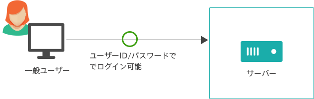

# more secure ssh
公開鍵認証を使ってより安全にsshしてみます。  
理論はおいといて、設定ができることに重点を置きます。

## 公開鍵認証とは
> :link: [さくらのナレッジ - 「よくわかる公開鍵認証」](https://knowledge.sakura.ad.jp/3543/)  
> sshはサーバー上で任意のコマンドを実行できる便利なサービスですが、それを使ってサーバーを自在にコントロールできるため、クラッカーにとっては格好の標的になります。したがって、不正ログインなどの攻撃を防ぐため安全対策に気をつかわなければなりません。  
> .  
> .  
> 一般ユーザーはパスワードが分かれば誰でもログインできてしまいます。  
>
>   
>
> これを、公開鍵認証方式を使って**「鍵を持っている人(パソコン)からのみ、一般ユーザーによるログインを許可する。」**という方式に変更します。これにより、パスワード総当り攻撃などで第三者に不正にsshのログインを試みられても、鍵が盗まれない限り破られることはありません。  
>
> 公開鍵認証方式でログインするには**鍵が2つ必要**です。パソコン側に置く秘密鍵ファイルと、サーバー側に置く公開鍵ファイルです。秘密鍵ファイルは人に知られてはいけません。公開鍵ファイルは、人に知られても良い(公開できる)ファイルです。この2つのファイルが揃って初めて公開鍵認証によるログインが可能になります。公開鍵認証では、sshのログイン時に使ったパスワードの代わりに「パスフレーズ」を使用します。サーバーへログインするパスワードと似たようなもので、自分が決めた文字列を設定できますが、これはサーバーへログインするためのものではなく、秘密鍵にアクセスするための秘密の文字列です。  
>
>   

## いまからやること
1. 秘密鍵と公開鍵の生成
1. サーバーへ公開鍵を登録
1. 秘密鍵と公開鍵を使って`ssh`（ゴール）
1. `~/.ssh/config`に設定を書いておく（補足）

## OS
Ubuntu 16.04 (e.g WSL)

## (Step 1) 秘密鍵と公開鍵の生成

### Install ssh
```
$ sudo apt update
$ sudo apt upgrade
$ sudo apt install ssh
```

### Generate keys
`ssh-keygen`コマンドで、秘密鍵と公開鍵のペアを作れる。
```
$ cd; mkdir -p .ssh; chmod 700 .ssh; cd .ssh
$ ssh-keygen -t rsa
```
以下のように出るので、好きなパスフレーズを設定（今後`ssh`するときに毎回使うパスフレーズとなる）。
```
.
.
Enter file in which to save the key (/home/kottn/.ssh/id_rsa):        # <- これはそのままEnter
Enter passphrase (empty for no passphrase):                           # <- お好きなパスフレーズ
Enter same passphrase again:                                          # <- 再入力
.
.
SHA256:XXXXXXXXXXXXXXXXXXXXXXXXXXXXXXXXXXXXXXXXXXX kottn@hostname     # <- これはfingerprint（今メモんなくていい）
.
.
```
確認。
```
$ ls -l
-rw------- 1 kottn kottn 1766 Mar 20 16:00 id_rsa       # 秘密鍵(Private key)
-rw-r--r-- 1 kottn kottn  395 Mar 20 16:00 id_rsa.pub   # 公開鍵(Public key)
```
* `id_rsa`  
**秘密鍵**。テキストファイル。他の人に漏らしたらダメなやつ。**「生成したマシンの中だけに存在していい」**と覚えておく。もちろん、メールなどネットワークの海に投げるのは厳禁。原理的にマシンの外に持ち出す必要性がないので、外部メディアへのコピーもするべきではない。マシン内のコピーであれば大丈夫。なのでWSLじゃなくてそのマシンにインストールしているRLoginやPuTTYで接続したいってなったときに、読みに行ける場所にこれをコピーするとかはOK。ただうっかりDropBoxなどのCloud系フォルダにはコピーしないこと。
* `id_rsa.pub`  
**公開鍵**。テキストファイル。**中身を接続先のサーバーの`~/.ssh/authorized_keys`に登録する**（後述）。他の人に教えてもよい。新規接続が公開鍵認証を要求するときは、サーバーの管理者にこれを渡して登録してもらったりする。管理者にはメールとかで渡してもいい。レンタルサーバとかだと専用ポータルサイト（マイページなど）に公開鍵を登録したりする場合も多い。

### fingerprint
さっきでてきた`SHA256:XXXXXXXXXXXXXXXXXXXXXXXXXXXXXXXXXXXXXXXXXXX` は、fingerprintといって、鍵が本物であるか見分けるための、鍵の指紋みたいなものです。ペアの秘密鍵と公開鍵であれば、fingerprint は同じはずです。  
fingerpirntは以下のコマンドで確認できます。
```
$ ssh-keygen -lf 鍵ファイル
鍵のビット数 ハッシュアルゴリズム:fingerprint ユーザー名@マシンホスト名 (暗号方式)
```
例：
```
$ ssh-keygen -lf id_rsa
2048 SHA256:GHxxxxxxxxxxxXXXXXXXXXXXXKa9qHzJluP/n3xxxxx kottn@hostname (RSA)
$ ssh-keygen -lf id_rsa.pub
2048 SHA256:GHxxxxxxxxxxxXXXXXXXXXXXXKa9qHzJluP/n3xxxxx kottn@hostname (RSA)
```
一致しているはずですがどうでしょうか。使う場面としては、新規に接続しようとした段階で、「このfingerprintをもつ公開鍵に接続するけど本当にいいかい？(yes|no): 」みたいな感じで聞かれるので、それがマシン内の`id_rsa`のfingerprintと一致しているかを確認してください。

## (Step 2) サーバーへ公開鍵を登録

